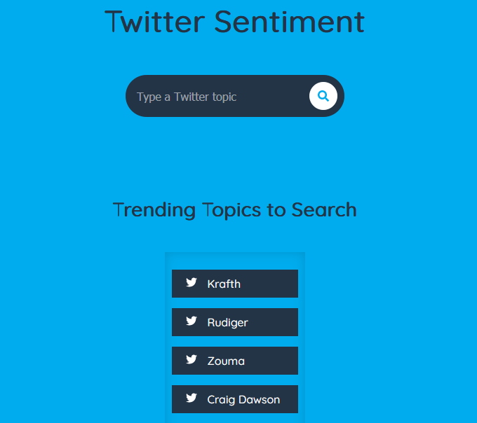
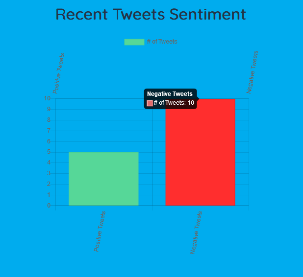
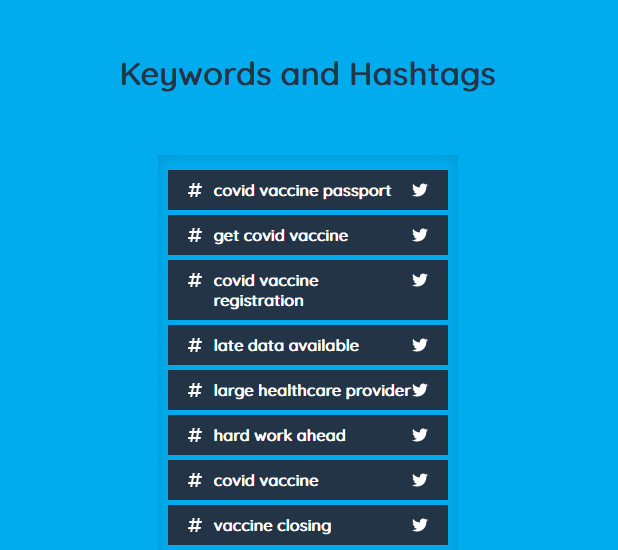

# Twitter Sentiment

This is a personal project I made to gather the sentiment of any topic on Twitter. 

### Tech

The following tools and languages were used during this project:

* Twitter API
* NLTK Naive Bayes Classifier
* Jupyter Notebooks
* Python
* Flask
* HTML/CSS/Javascript/JQuery

### Screenshots

